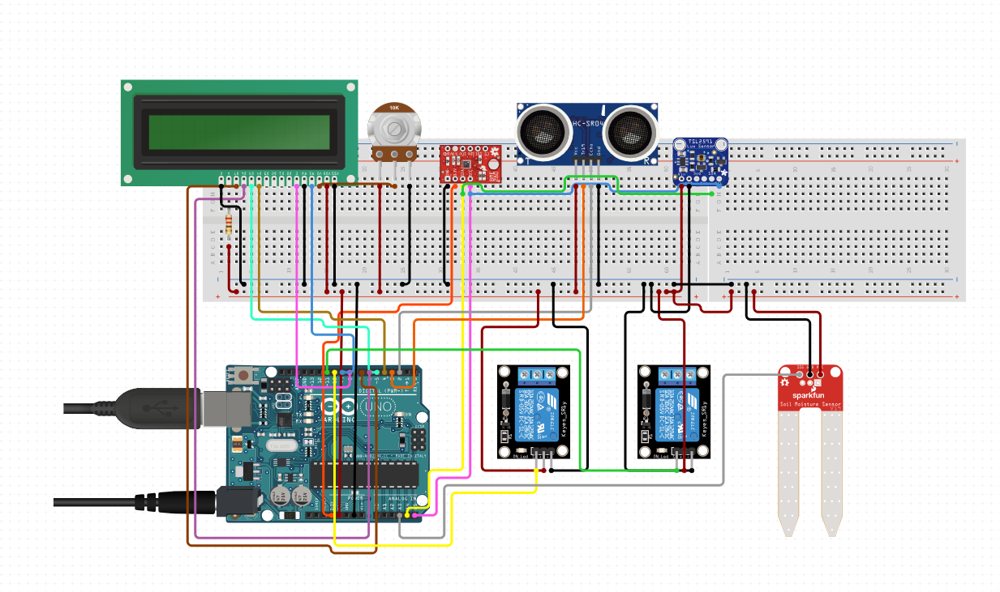
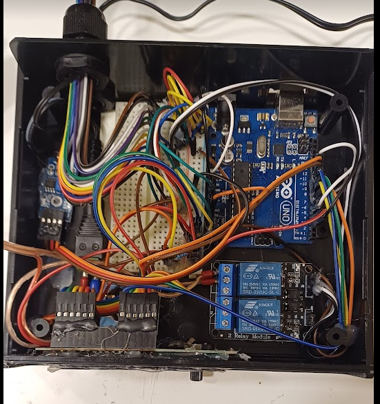
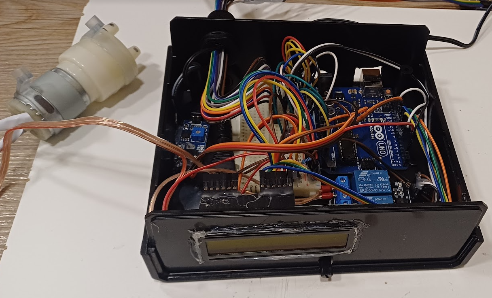
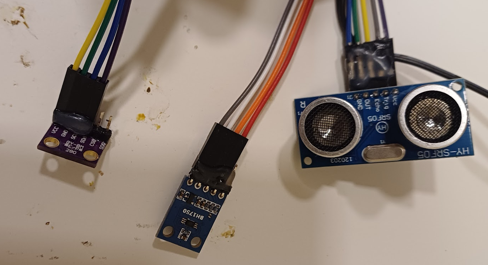
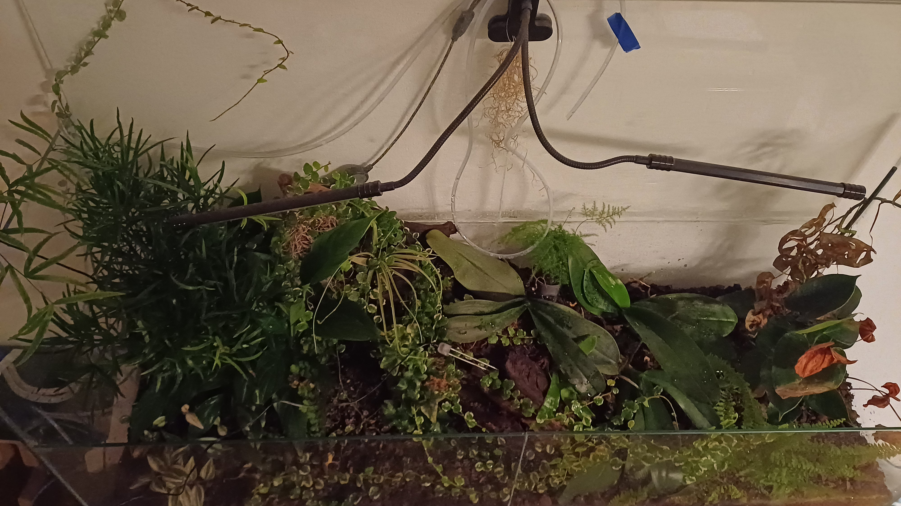
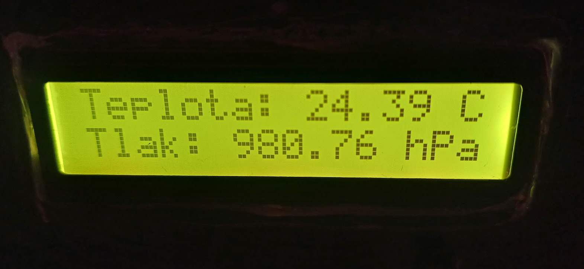
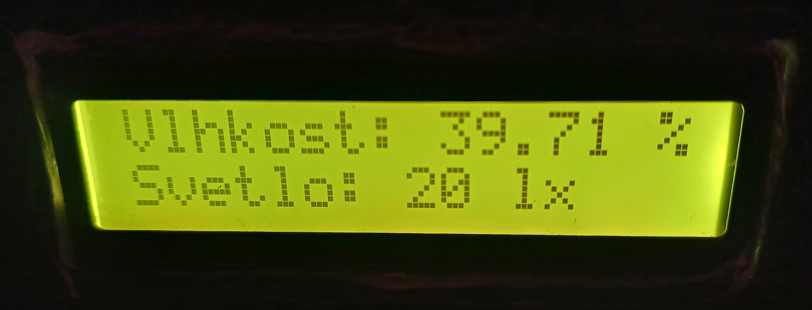
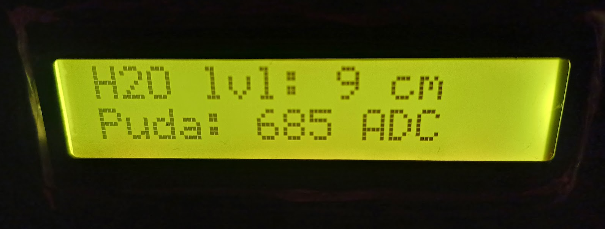

# SmartIrrigationSystem
This project is a Smart Irrigation System built with Arduino, which automates watering plants and monitoring environmental conditions using various sensors. The system includes features like a hysteresis-controlled pump, light activation based on ambient light levels, and real-time data display on an LCD.

# Smart Irrigation System 🌱💧

This Arduino-based **Smart Irrigation System** is designed to automate plant watering and monitor environmental conditions such as soil moisture, temperature, humidity, light intensity, and water level. It uses various sensors, relays, and an LCD for seamless automation and real-time feedback.

---

## Features

1. **Automatic Water Pump Control**  
   - Hysteresis-based logic ensures the pump runs only when the soil moisture exceeds a threshold and stops when it falls below a defined level.  
   - Prevents overwatering and optimizes water usage.

2. **Ambient Light Control**  
   - Activates light relay when the ambient light level drops below a specified threshold.

3. **Water Level Monitoring**  
   - Uses an ultrasonic sensor to measure the distance to the water surface and alerts when the level is too low.

4. **Real-Time Data Display**  
   - A 16x2 LCD shows temperature, humidity, soil moisture, light intensity, and water level in a rotating manner.

5. **Modular Design**  
   - Functions are well-structured for readability and reuse.

6. **Serial Output**  
   - Real-time data is printed to the serial monitor for debugging or advanced monitoring.

---

## Components Required 🛠️

- **Microcontroller:** Arduino Uno or compatible
- **Sensors:**
  - BME280 (Temperature, Pressure, Humidity)
  - BH1750 (Light Intensity)
  - Ultrasonic Sensor (e.g., HC-SR04) for water level
  - Soil Moisture Sensor
- **Actuators:**
  - 2-channel Relay Module
  - Water Pump
- **Others:**
  - 16x2 LCD Display with I2C
  - Jumper wires, breadboard, power supply, and resistors

---

## Wiring Diagram



---

## Code Explanation

### Core Functions

1. **`setup()`**
   - Initializes all components (LCD, sensors, and pins).
   - Checks if sensors are properly connected and functional.

2. **`loop()`**
   - Reads data from sensors and processes it.
   - Controls the water pump and light relay based on sensor values.
   - Updates the LCD display and outputs real-time data to the serial monitor.

3. **`updateDisplay(int state, ...)`**
   - Updates the LCD screen to show different data sets in a cyclic manner.
   - States:
     - **0:** Temperature and pressure
     - **1:** Humidity and light intensity
     - **2:** Water level and soil moisture

4. **`getWaterLevel()`**
   - Uses the ultrasonic sensor to measure the water level.
   - Averages multiple readings for accuracy.

---

## How It Works

1. **Pump Control Logic:**  
   - If soil moisture exceeds `soilThresholdHigh`, the pump turns on.  
   - It continues to pump water until the soil moisture falls below `soilThresholdLow`.

2. **Light Control Logic:**  
   - Turns the light on when the ambient light intensity drops below the defined threshold.

3. **Water Level Alert:**  
   - Continuously checks the water level and sends an alert if it's below a critical level.

4. **LCD Display Modes:**  
   - Rotates between three display states every second:
     - State 0: Temperature & Pressure
     - State 1: Humidity & Light
     - State 2: Water Level & Soil Moisture

## Installation

1. Clone the repository:
   ```bash
   git clone https://github.com/VojtekCZ/SmartIrrigationSystem.git
2. Open the .ino file in the Arduino IDE.
3. Install the required libraries:
   - Adafruit BME280 Library
   - BH1750 Library
   - NewPing Library
4. Upload the code to your Arduino.

## Gallery

System Overview





LCD Display Examples




